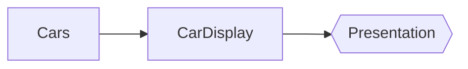
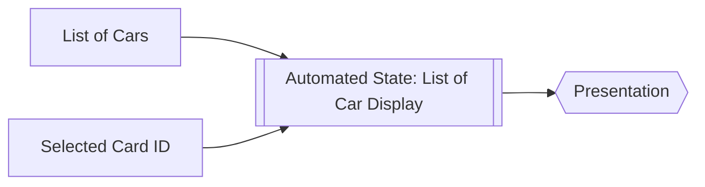

# MVI + State Automation
Designed by [Stefanus Ayudha](https://github.com/stefanusayudha)

## Use MVI
Communication should be done in single channel, that just make sense.

## Model hold the UI State


## Use Automated State


## Example
### The Models
```kotlin
@JvmInline
value class CarID(val value: String)

@JvmInline
value class CarName(val value: String)  

data class Car(
    val id: CarID,
    val name: CarName,  
)

data class CarDisplay(
    val car: Car,
    val selected: Boolean = false,
)
```

### The Intents
```kotlin
sealed interface MViewModelIntent

object Idle : MViewModelIntent

data class SelectCar(
    val carID: CarID
): MViewModelIntent

data class UpdateCarList(
    val pld: GetCarsPLD
): MViewModelIntent
```

### The viewModel
```kotlin
class MViewModel(
    val repo: CarRepo
) : ViewModel() {
    
    val intent by register<MViewModelIntent>(Idle)

    /** provide data of cars **/
    val carsProvider: Provider<GetCarsPLD, List<Car>> by lazy {
        val provider by provider(operator = repository::getCars)
        
        /** automate the provider on receive message **/
        provider.automate {
            collect(intent.data) { i ->
                if (i is UpdateCarList) {
                    provider.update(intent.pld)
                }
            }
        }
    }
    
    /** selected car, in case user select a car from the list**/
    val selectedCarID: Flow<Option<CarID>> by lazy { 
        MutableState(None)
            .automate { flow ->
                collect(intent.data) { i ->
                    if (i is SelectCar) {
                        flow.emit(Some(i.carID))
                    }
                }
            }
    }

    /** # Model Hold The UI State 
     * Car display list is a list of CarDisplay not Car. 
     * The purpose of CarDisplay object is to make it capable to hold the UI state with it, such selected, maybe enable and disable as well.
     * **/
    val carsDisplay: Flow<List<CarsDisplay>> =
        /** automation state **/
        combine(
            sampleProvider.success,
            selectedCarID,
        ) { carProviderSuccess, selectedCarID ->
            carProviderSuccess
                .fold {
                    ifEmpty = { listOf()}
                    ifSome = { it }
                }
                /** manage selected car **/
                .map {
                    CarDisplay(
                        car = it,
                        selected = it.id == selectedCarID
                    )
                }
        }.flowOn(Dispatchers.IO)
}
```

Now you can observe the car list display and just render it. No Side effect, Less code Diversity.
