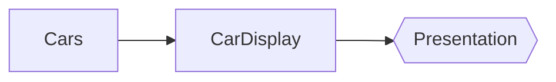
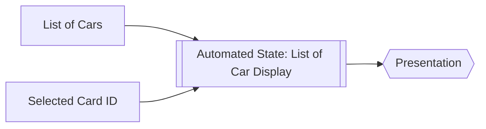

# MVI + State Automation

Model hold the UI State


Use Automated State


Example
```kotlin
data class Car(
    val id: String
)

data class CarDisplay(
    val car: Car,
    val selected: Boolean
)

class MViewModel(
    val repo: CarRepo
) : ViewModel() {

    val carListProvider by provider(repo::getCarList)
    val selectedCarId: Flow<String>

    val carListDisplay by lazy {

        /** internal private flow **/
        val flow = MutableStateFlow(listOf<CarDisplay>())

        /** updater **/
        val updater = lazyFunction {
            val currentList = carListProvider.success.first().second ?: listOf<Car>()
            val selectedId = selectedCarId.first()

            val carListDisplay = currentList
                .map { car ->
                    CarDisplay(
                        car = car,
                        selected = car.id == selectedId
                    )
                }

            flow.emit(carListDisplay)
        }

        /** state relations **/
        run {
            collect(
                carListProvider.success
            ) {
                updater.tryInvoke(
                    signature = "carListProvider + ${System.currentTimeMillis()}"
                )
            }

            collect(
                selectedCarId
            ) {
                updater.tryInvoke(
                    signature = "selectedCarId + ${System.currentTimeMillis()}"
                )
            }
        }
        
        flow
    }
}
```

Now you can observe the car list display and just render it. No Side effect, Less code Diversity.
